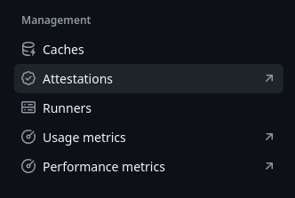
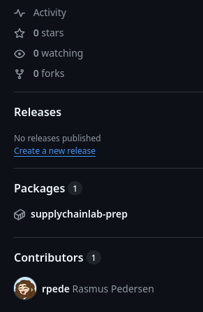

# Supply Chain Lab

## Intro

This lab will show you how to:

1. Build and publish a container image with attestation
2. Inspect attestation locally
3. Extract SBOM from manifest

## Prerequisites

It that you are already familiar with GitHub Actions (GHA).

If you need to brush up on GHA knowledge, try:

- [Introduction to GitHub Actions](https://learn.microsoft.com/en-us/training/modules/introduction-to-github-actions/)
- [Leverage GitHub Actions to publish to GitHub Packages](https://learn.microsoft.com/en-us/training/modules/github-actions-packages/)

For Docker, take a look at [Docker - Get Started](https://docs.docker.com/get-started/)

## Build and publish a container image with attestation

### Workflow

Create a new Actions workflow with the following:

```yaml
name: "Build, Attest and Push container image"

# This workflow is triggered manually
on: workflow_dispatch

permissions:
  contents: read
  packages: write
  id-token: write
  attestations: write

env:
  CONTAINER_IMAGE_NAME: ${{ github.repository }}

jobs:
  container-image:
    runs-on: ubuntu-latest
    steps:
      - name: Checkout code
        uses: actions/checkout@v5

      - name: Set up Docker Buildx
        uses: docker/setup-buildx-action@v4

      - name: Log in to the Github Package Container registry
        uses: docker/login-action@v4
        with:
          registry: ghcr.io
          username: ${{ github.actor }}
          password: ${{ secrets.GITHUB_TOKEN }}

      - name: Docker metadata
        id: docker-meta
        uses: docker/metadata-action@v6
        with:
          images: ghcr.io/${{ env.CONTAINER_IMAGE_NAME }}
          tags: type=sha,format=long

      - name: Build and Push container images
        uses: docker/build-push-action@v7
        id: build-and-push
        with:
          sbom: true
          provenance: true
          push: true
          tags: ${{ steps.docker-meta.outputs.tags }}
          labels: ${{ steps.docker-meta.outputs.labels }}

      - name: Generate container image attestation
        uses: actions/attest@v4
        with:
          subject-name: ghcr.io/${{ env.CONTAINER_IMAGE_NAME }}
          subject-digest: ${{ steps.build-and-push.outputs.digest }}
          push-to-registry: true
```

### Understand the workflow

Get an overview of what each of the actions does.

- <https://github.com/docker/setup-buildx-action>
- <https://github.com/docker/login-action>
- <https://github.com/docker/metadata-action>
- <https://github.com/docker/build-push-action>
- <https://github.com/actions/attest>

You can find additional information about Docker GitHub Actions
[here](https://docs.docker.com/build/ci/github-actions/).

### Run the workflow

Now that you understand the workflow, let's run it.
Go to the "Actions" tab and trigger the workflow.
Wait for the workflow to complete.

You can inspect attestation metadata directly from GitHub.



## Inspect attestation locally

### Find image URL

Go to your repository page.
Click on the package shown on the right.



Alternatively, you can go to your GitHub page and click on the Packages tab
(`https://github.com/<user>?tab=packages`).

You can run the command shown on your computer to pull the image.
It should show `docker pull <image-url>`, where the image URL is structured like
`ghcr.io/<user>/<repo>:sha256-<hash>`.

### Inspect and verify attestation

To inspect provenance attestation, run:

```sh
docker buildx imagetools inspect <image-url> --format "{{ json .Provenance.SLSA }}"
```

To inspect SBOM attestation, run:

```sh
docker buildx imagetools inspect <image-url> --format "{{ json .SBOM.SPDX }}"
```

You can verify the attestation with [GH CLI](https://cli.github.com/).

```sh
gh attestation verify --owner <user> oci://ghcr.io/<user>/<repo>@sha256:<hash>
```

You can scan the image for vulnerabilities with [Trivy](https://trivy.dev/).
I prefer to run Trivy trough Docker, given the [recent
breach](https://www.bleepingcomputer.com/news/security/trivy-vulnerability-scanner-breach-pushed-infostealer-via-github-actions/).

```sh
docker run dhi.io/trivy:0-debian13-dev image <image-url>
```
